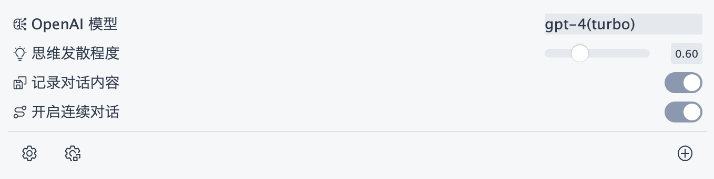

# AI at Haozheli.com

Hello! Welcome to the introduction to using AI at Haozheli.com!

## Quick Start
First, you need to visit [ai.haozheli.com](https://ai.haozheli.com). After visiting, you will see the following interface:

If you are a first time user, you may need to click on [ai.haozheli.com](https://ai.haozheli.com) to get a password, or you can [click here](https://www.haozheli.com/getPassword/index.html) to get a password.

After you get the password, you can enter it by clicking **Global Settings** in the lower left corner. After everything is done you can use [ai.haozheli.com](https://ai.haozheli.com)!

## Settings Adjustment
You can adjust the way AI runs in the following settings:

### Global Settings

- **Website access password:** Please enter your password here
- **Send with Enter:** whether to send the message with enter, otherwise it will be shift + enter

### Dialog settings

- **AI Model:** Please choose the AI model that suits you, the most advanced one is GPT-4 Turbo at present.
- **The degree of thinking:** You can control the imagination of AI.
- **Recorded dialog content**
- **Continuous dialog**

### Other options

- **Disguise mode:** Disguise AI dialogs
- **Export Picture**
- **Export Markdown**
- **Empty all data**