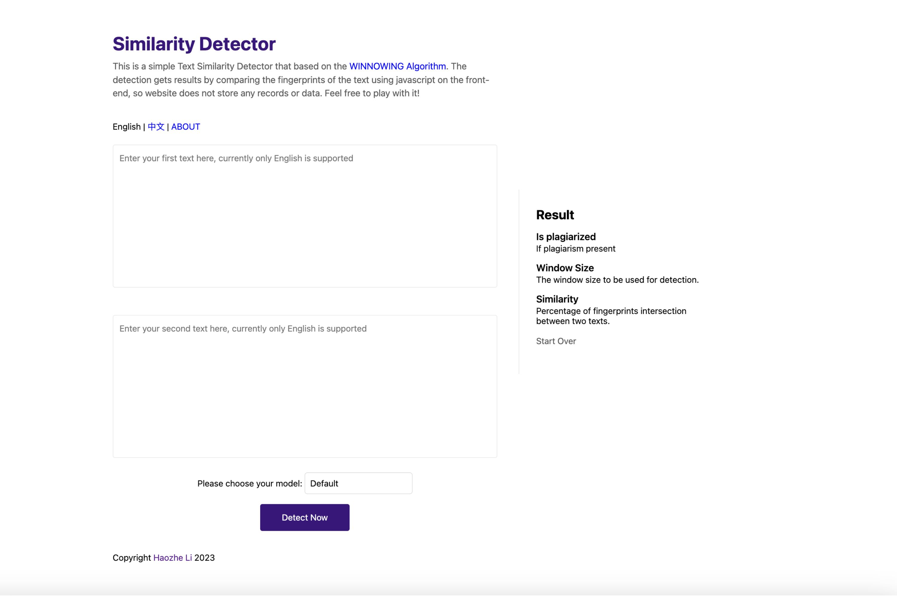

# Using WINNOWING Algorithm to detect text similarity

# How To Use?



## Quick Start

What you only need to do is copy and paste two texts (needed to be English) into [Detect.haozheli.com](http://detect.haozheli.com/), then click the detect now button to get result instantly.

## Detect More Accurately

Here are two tips that will make your detection more accurately.

- **More Words:** When using the detector, ensure your text is at least 100 words. Fewer words result in a shorter detection window and may yield unexpected results.
- **Change Model:** To change the detection model, use the Select button next to the Detect Now button. The default model is recommended. But if you get a wired result or want to try something new, feel free to change the model to strict or loose.
- **********Start Over:********** After every detection, I would recommend you to click start over button. This will clear all the texts, results, settings as well as caches. So you can easily start to detect your next work.

## Know the Result

Below I will be discussing what each element of result means.

- ****Is plagiarized:**** Here you are expected to get a simple “Yes” or “No” answer. This is the overall consideration if plagiarized occurs.
- ****Window Size:**** Here you are expected to get an integer from 1 to 100. This indicates the auto window size generated for you.
- ******************Similarity:****************** Here you are expected to get a percentage, in which two texts are similar to each other. This is calculated by intersection of fingerprints, so it does not mean the actual words intersection.

# How It Works?

[Detect.haozheli.com](http://detect.haozheli.com/) implements [WINNOWING algorithm](https://dl.acm.org/doi/10.1145/872757.872770) via javascript to get similarity report on front-end. So no data or records are uploaded or stored. Also, because of using javascript, this tool can be used offline if you cache this website.

## Algorithm Overview

The WINNOWING algorithm is a local text similarity detection technique used to identify duplicate or near-duplicate passages within a set of documents. It operates by creating fixed-size "windows" of text, hashing these windows, and then selecting the minimum hash value within each window. These minimum hashes are used to create a fingerprint for the document. By comparing these fingerprints across documents, the algorithm can identify potentially plagiarized passages.

## Academic Reference

The algorithm we plan to implement is the **WINNOWING algorithm** for text plagiarism detection. The algorithm is well-documented in the paper titled *"Winnowing: Local Algorithms for Document Fingerprinting"* by Schleimer, J., Wilkerson, D. S., & Aiken, A. This paper defines the algorithm and its core principles. [https://dl.acm.org/doi/10.1145/872757.872770](https://dl.acm.org/doi/10.1145/872757.872770)

To help us read it easier, here is the pdf version on the Stanford website [http://theory.stanford.edu/~aiken/publications/papers/sigmod03.pdf](http://theory.stanford.edu/~aiken/publications/papers/sigmod03.pdf)

They are exact the same.

## Source Code

From now, I will be discussing the source code used in my similarity detector.

### preprocessText function

- This function is used to clean up the input text to avoid distracting information.
- This function iterates over each character in the text (string), removes useless symbols, and converts all letters to lowercase.
- The function returns a list of cleaned up tokens.

```jsx

 // Preprocess the text: tokenize and convert to lowercase
function preprocessText(rawText) {
  let tokens = [];
  let token = "";

  for (let i = 0; i < rawText.length; i++) {
    let c = rawText[i];
    
    if (/[a-zA-Z0-9]/.test(c) || /[\u4e00-\u9fa5]/.test(c)) {
      if (/[A-Z]/.test(c)) {
        token += c.toLowerCase();
      } else {
        token += c;
      }
    } else if (token !== "") {
      tokens.push(token);
      token = "";
    }
  }

  if (token !== "") {
    tokens.push(token);
  }

  return tokens;
} 
```

### createWindows function

- This function is used to create a window.
- This function will create a window based on windowSize, sliding back in processedText.
- The function returns a list of all windows.

```jsx
// Create windows from the processed text
  function createWindows(processedText, windowSize) {
    let windows = [];
    for (let i = 0; i <= processedText.length - windowSize; i++) {
        let window = "";
        for (let j = i; j < i + windowSize; j++) {
            window += processedText[j];
            // Only add a space if it's not the last word in the window
            if (j < i + windowSize - 1) {
                window += " ";
            }
        }
        windows.push(window);
    }
    return windows;
  }
```

### The hashWindows function

- This function claims a hash value for each window.
- In this function, I use a very simple round-robin hash: multiply the hash by 31 and add the ascii value of the character. This hash calculation is very rudimentary, and I will replace it with something else at a later date.
- A list of hashes will be returned.

```jsx
// Hash the windows using a simple hash function (you should replace this with a better hash function)
  function hashWindows(windows) {
    let hashes = [];
    for (let i = 0; i < windows.length; i++) {
        let hash = 0;
        for (let j = 0; j < windows[i].length; j++) {
            let c = windows[i].charCodeAt(j);
            hash = 31 * hash + c;
        }
        hashes.push(hash);
    }
    return hashes;
  }
```

### getFingerprints function

- This function puts hashes into a collection, which will weed out duplicate hashes.
- Returns a collection containing hashes called fingerprints.

```jsx
// Get the fingerprints from the hashes
  function getFingerprints(hashes) {
      let fingerprints = new Set();
      for (let i = 0; i < hashes.length; i++) {
      fingerprints.add(hashes[i]);
      }
      return fingerprints;
  }
```

### Detecting sensitivity and the detectPlagiarism function

- The first seven lines of the code are used to get the user-selected sensitivities, as well as the declaration of similarity.
- The detectPlagiarism function calculates the intersection of the fingerprints of the two texts and calculates the percentage of overlap of the intersection. If this percentage is greater than the sensitivity threshold set by the user it will return True, indicating the presence of plagiarism.
- detectPlagiarism returns a Boolean value (True or False).

```jsx
let percentage = 0;
    const sensitivitySelect = document.getElementById('sensitivity');
    let sensitivity = 4;
    sensitivitySelect.addEventListener('change', function () {
        const selectedValue = sensitivitySelect.value;
        sensitivity = parseInt(selectedValue);
    });

    // Detect plagiarism by comparing the fingerprints
  function detectPlagiarism(fingerprints1, fingerprints2) {
    let intersection = new Set([...fingerprints1].filter(x => fingerprints2.has(x)));
    let intersectionSize = intersection.size;
    let union = new Set([...fingerprints1, ...fingerprints2]);
    let unionSize = union.size;
    let similarity = intersectionSize / unionSize;
    percentage = similarity * 100;
    return percentage > sensitivity;
  }
```

### runPlagiarismDetection Function

- This function will run all of the above functions and show the result.

```jsx
function runPlagiarismDetection() {
    // Get the input text from the textboxes
    let text1 = document.getElementById("text1").value;
    let text2 = document.getElementById("text2").value;

    // Preprocess the texts
    let processedText1 = preprocessText(text1);
    let processedText2 = preprocessText(text2);

    let windowSize = text1.length < text2.length ? Math.floor(text1.length / 10) : Math.floor(text2.length / 10);
    if (windowSize < 1) {
      windowSize = 1;
    }
    if (windowSize > 100) {
      windowSize = 100;
    }

    document.getElementById("windowsize").innerText = windowSize;

    // Create windows
    let windows1 = createWindows(processedText1, windowSize);
    let windows2 = createWindows(processedText2, windowSize);

    // Hash the windows
    let hashes1 = hashWindows(windows1);
    let hashes2 = hashWindows(windows2);

    // Get the fingerprints
    let fingerprints1 = getFingerprints(hashes1);
    let fingerprints2 = getFingerprints(hashes2);

    // Detect plagiarism
    let isPlagiarized = detectPlagiarism(fingerprints1, fingerprints2);
    document.getElementById("fg").innerText = Math.floor(percentage) + "%";

// Display the result
    document.getElementById("result").innerText = isPlagiarized ? "True" : "False";
  }
```

# Ending

Congratulations on seeing this! This is the end of the article and hopefully you will already be using Similarity Detector as well as understanding how it works. If you have any questions, feel free to comment on the article or head over to my website [haozheli.com](https://www.haozheli.com/) to contact the author.

This article is written by @浩哲 李.