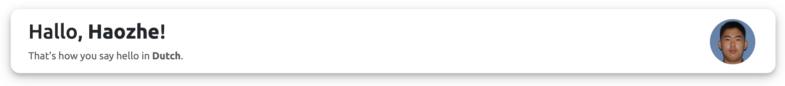

# 在网页中使用JavaScript实现不同语言打招呼的效果

## 声明

本人仅仅喜欢编程，在大多数时候水平都不高。该文章建议图一乐，如果有任何建议，请告诉我。

## 介绍

首先，我的灵感来自于这里：[**CS128**](https://cs128.org) ，这个是我们学校C++介绍课程的网站。在每次进入网站时，网页都会以不同的语言像我打招呼，并注明这个语言的名字。




每次刷新的时候打招呼的语言也会改变，看起来非常有意思。所以我也把这个效果引入了我的个人网站中：[**我的个人网站**](https://www.haozheli.com)


今天我将介绍如何使用html以及JavaScript来实现这一功能。

## HTML

在HTML中，代码是非常简单的。例如，如果我们想让标题显示问候语，下面的段落解释问候语的语言，我们只需要在html中为标题以及段落插入代码。

```html
<h1></h1>
<p></p>
```

其中<h1>代表标题，<p>代表段落。我们只是插入这两个标签，不需要在其中写任何东西，因为之后的JavaScript代码会覆盖我们现在写的东西。

## 思路

首先，以下是我对实现随机问候的思路。

- 首先创建两个同样长度的数组：其中一个是不同语言的打招呼，另外一个是解释打招呼的是什么语言。注意：这两个数组需要同样的长度

```html
//这是一段伪代码！！！

打招呼的数组 = ["你好", "Hello"]
语言的数组 = ["中文", "英文"]
```

- 然后我们需要创建一个随机数来迭代两个数组从而实现随机的打招呼。然后通过数组的索引访问两个数组内的内容

```html
//这个还是一段伪代码！！！

随机数 = 一种神奇的算法得到一个列表长度内的随机数字

打招呼 = 打招呼的数组[随机数]
语言 = 语言的数组[随机数]
```

- 最后，我们把问候语和解释语放在前面HTML代码中指定的地方

```html
//这真的还是伪代码！！！

标题 = 打招呼 + "，很高兴见到你"
解释 = 打招呼 + "在" + 语言 + "中是你好的意思"
```

## JavaScript代码实现

按照前面的思路，我们只需要一步步实现代码就可以了

- 声明两个数组

```jsx
var greetings = ["hello", "你好"];
var languages = ["英文", "中文"];
```

- 生成随机数

```jsx
var index = Math.floor(Math.random() * greetings.length)
```

这行代码的意思是生成一个随机数字，然后将其作为数组的索引，从而从数组中选择一个语言问候。

首先，**`Math.random()`**方法返回一个介于0（包括）和1（不包括）之间的随机数字。

然后，我们乘上**`greetings.length`**，以便生成一个介于0和**`greetings.length`**之间的数字。这意味着随机生成的数字可以从0到数组长度（不包括数组长度）-1中选择。

最后，我们使用**`Math.floor`**方法将生成的数字向下取整，以便生成一个整数，这是因为数组索引只能是整数。

所以，**`var randomIndex = Math.floor(Math.random() * greetings.length);`**表示生成一个随机整数，作为数组索引，从而从数组**`greetings`**中选择一个语言问候。

- 通过索引获得单个元素

```jsx
var greeting = greetings[index];
var language = languages[index];
```

- 最后我们在将打招呼和解释的语言放到之前的HTML代码中指定的地方

```jsx
document.querySelector('h1').innerHTML = greeting + ',';
document.querySelector('p').innerHTML = "In " + language + ", " + greeting + " means hello!";
```

第一行代码表示选择页面中的第一个**`<h1>`**标签，并修改其内部的HTML内容。

首先，**`document.querySelector`**方法用于选择页面中第一个与给定选择器匹配的元素。在这种情况下，选择器是**`"h1"`**，因此这个方法会选择页面中的第一个**`<h1>`**标签。

然后，我们使用**`.innerHTML`**来修改选定元素的内部HTML。如果将其设置为一个新字符串，则将替换其原始内容。

所以，**`document.querySelector("h1").innerHTML`**表示选择页面中的第一个**`<h1>`**标签，并将其内部的HTML内容修改为指定的字符串。

所以同理，第二行**`document.querySelector("p").innerHTML`**表示选择页面中的第一个**`<p>`**标签，并将其内部的HTML内容修改为指定的字符串。

但在之类需要注意，我们必须将自己的标题以及段落放在网页最上面。要在其他地方实现该效果，可以使用id的方法，在这里我就不再赘述。

- 最后，我们把JavaScript代码全部放在一个函数下，以实现只有在页面加载完毕后才会加载的效果。完整的JavaScript代码如下。

```jsx
<script>
        window.onload = function() {
          var greetings = ['你好', 'Bonjour', 'こんにちは', 'Hello', '안녕하세요', 'Здравствуйте', 'Aloha', 'Hallo', 'chào', 'Ciao', 'Hola'];
          var languages = ['Chinese', 'French', 'Japanese', 'English', 'Korean', 'Russian', 'Hawaiian', 'German', 'Vietnamese', 'Italian', 'Spanish']
          var index = Math.floor(Math.random() * greetings.length)
          var greeting = greetings[index];
          var language = languages[index];
          document.querySelector('h1').innerHTML = greeting + ',';
          document.querySelector('p').innerHTML = "In " + language + ", " + greeting + " means hello!";
        };
    </script>
```

将该代码放在html文件底部就可以了

## Sample

大家可以[**访问这里**](https://www.haozheli.com/blogs/greetingsSample.html)来查看该效果的样例，全部代码如下：

```jsx
<!DOCTYPE html>
<html>
  <head>
    <title>My Simple HTML File</title>
  </head>
  <body>
    <h1>Hello World</h1>
    <p>This is a simple HTML file with only an h1 and a p tag.</p>
    <script>
        window.onload = function() {
          var greetings = ['你好', 'Bonjour', 'こんにちは', 'Hello', '안녕하세요', 'Здравствуйте', 'Aloha', 'Hallo', 'chào', 'Ciao', 'Hola'];
          var languages = ['Chinese', 'French', 'Japanese', 'English', 'Korean', 'Russian', 'Hawaiian', 'German', 'Vietnamese', 'Italian', 'Spanish']
          var index = Math.floor(Math.random() * greetings.length)
          var greeting = greetings[index];
          var language = languages[index];
          document.querySelector('h1').innerHTML = greeting + ',';
          document.querySelector('p').innerHTML = "In " + language + ", " + greeting + " means hello!";
        };
    </script>
  </body>
</html>
```

## 结尾

以上就是本文全部的内容了，很高兴你能看到这里！

在知乎阅读该文章

[在网页中使用JavaScript实现不同语言打招呼的效果](https://zhuanlan.zhihu.com/p/604068472)