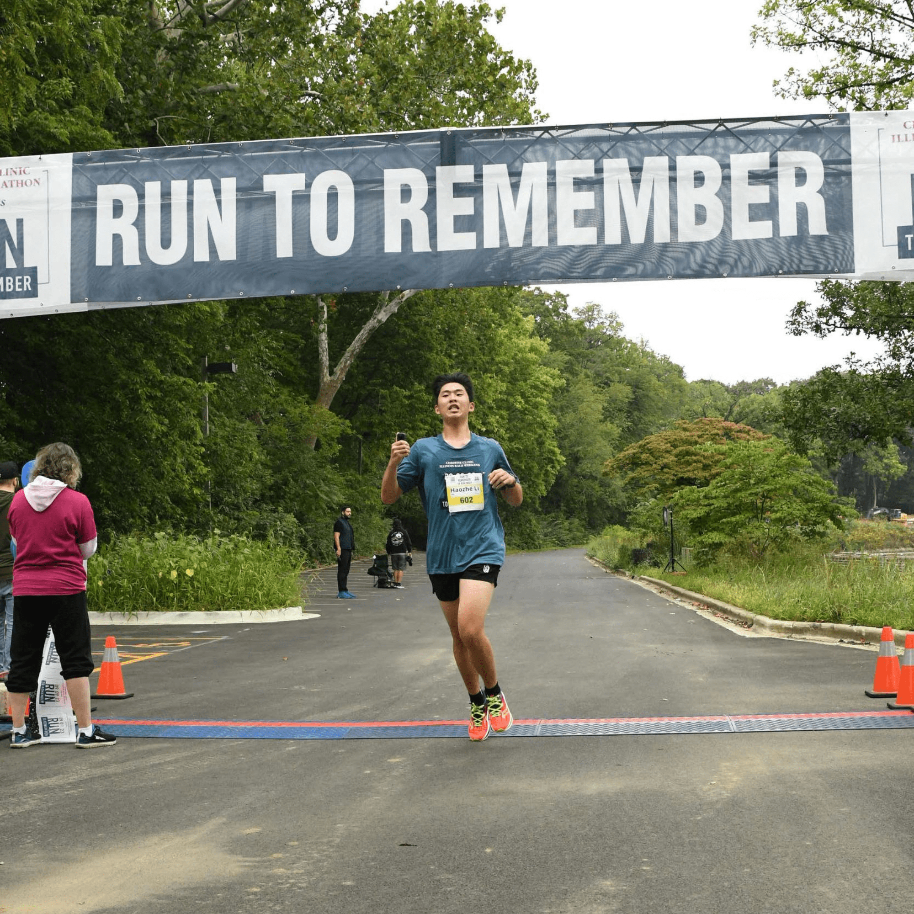
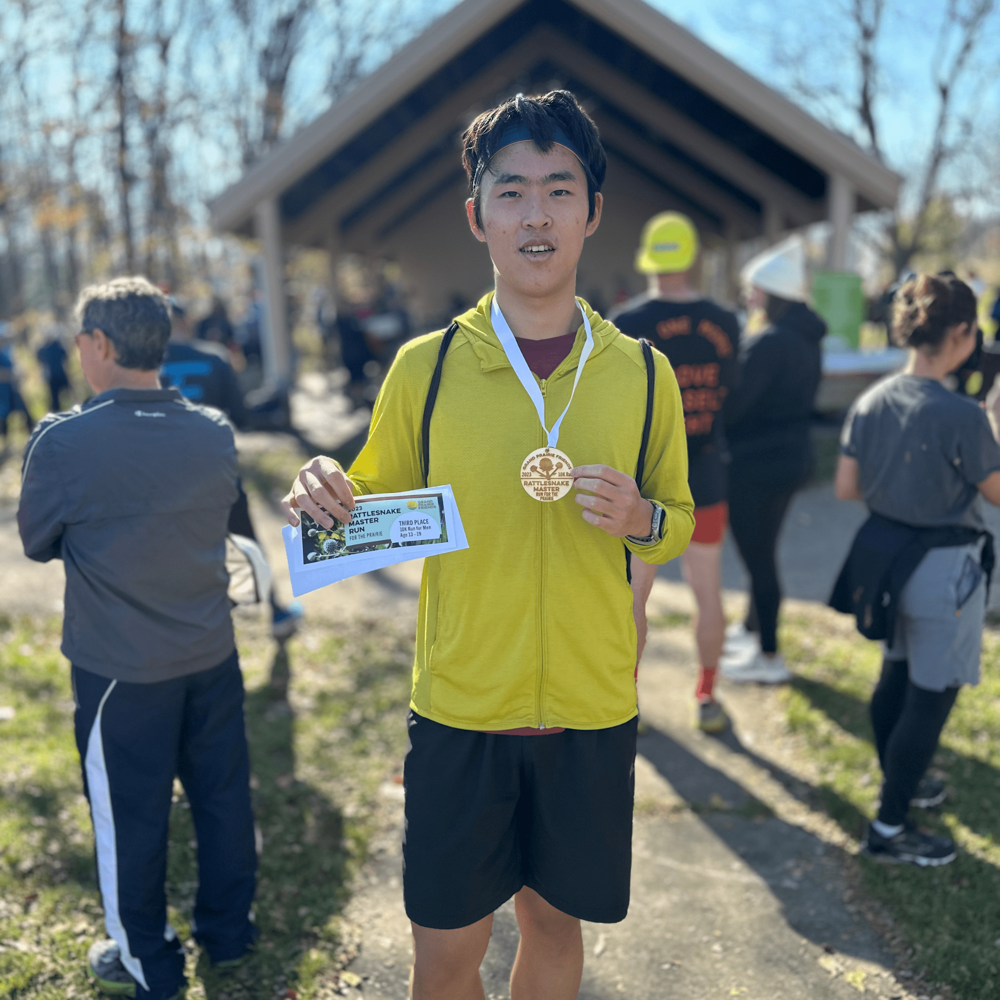
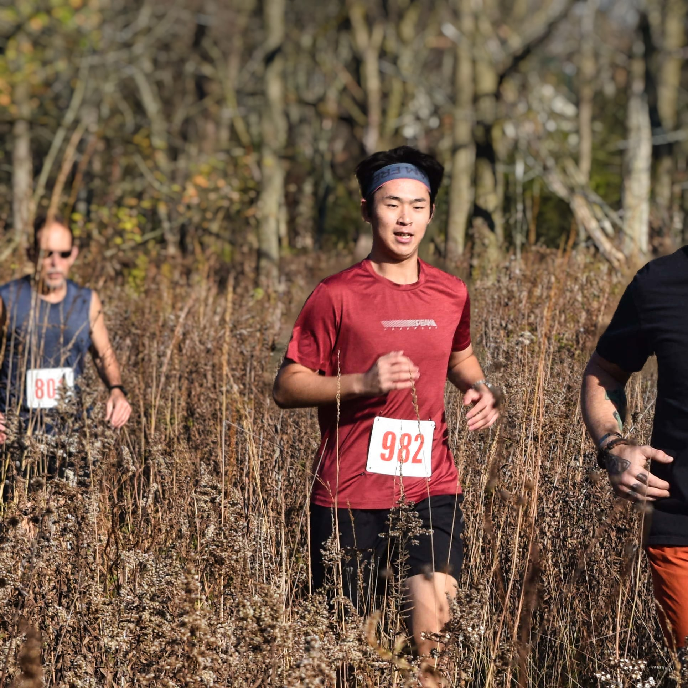

# 关于我的跑步

## 跑步事实

- **5K PB**：21:43
- **10K PB**：45:39
- **开始运行**：2023 年 7 月
- **跑步页面**：[RUN: run.haozheli.com](https://run.haozheli.com/)
- **关注我**：[Strava](https://www.strava.com/athletes/haozheli)

## 目标

- [ ] 上半程马拉松 2024 年 4 月 27 日
- [ ] 5K sub 20
- [x] 10K 低于 50
- [x] 5K 子 25
- [x] 完成一场跑步比赛

# 比赛

## RUN TO REMEMBER 5K

我的第一场比赛！

- 距离：5公里
- 时间：21:43
- 排名：总排名第六，年龄组冠军
- 详情：[Strava](https://www.strava.com/activities/9814724410)、[Bilibili](https://www.bilibili.com/video/BV1hm4y1P7Zn/)、[Youtube](https://www.youtube.com/watch?v=wAUfVo3kwnQ)
- 地点：伊利诺伊州厄巴纳
- 日期：2023 年 9 月 9 日
- 相片：
    
     
    
     
    

## Future So Bright 5K

第二场比赛！ 只是为了好玩，没有给出排名。 和朋友一起赛车绝对是疯狂的。

- 距离：5.53 公里
- 时间：24:08
- 排名：不适用
- 详情：[Strava](https://www.strava.com/activities/9984807297)
- 地点：伊利诺伊州香槟分校主广场大学
- 日期：2023 年 10 月 5 日
- 相片：
    
     
    

## Aruna Run 5K

我的第一次越野跑。

- 距离：5公里
- 时间：22:06
- 排名：总排名第 8
- 详情：[Strava](https://www.strava.com/activities/10037739416)、[Bilibili](https://www.bilibili.com/video/BV1b34y1g7B2/)、[Youtube](https:// www.youtube.com/watch?v=hxG1rl2VKjE&t=296s)
- 地点：伊利诺伊州厄巴纳伊利诺伊大学植物园
- 日期：2023 年 10 月 14 日
- 相片
    
     
    
     
    

## Rattlesnake Master Run 10K for the Prairie 10K

我的第一次万米比赛！

- 距离：10公里
- 时间：45:39
- 排名：总排名第 15，年龄组第 3
- 详情：[Strava](https://www.strava.com/activities/10165758315)、[Bilibili](https://www.bilibili.com/video/BV1My4y1w779/)、[Youtube](https:// www.youtube.com/watch?v=F7ltHilQJpg&t=85s)
- 地点：伊利诺伊州厄巴纳梅多布鲁克公园
- 日期：2023 年 11 月 5 日
- 相片：

更新中...

なあ、走るの好きか？