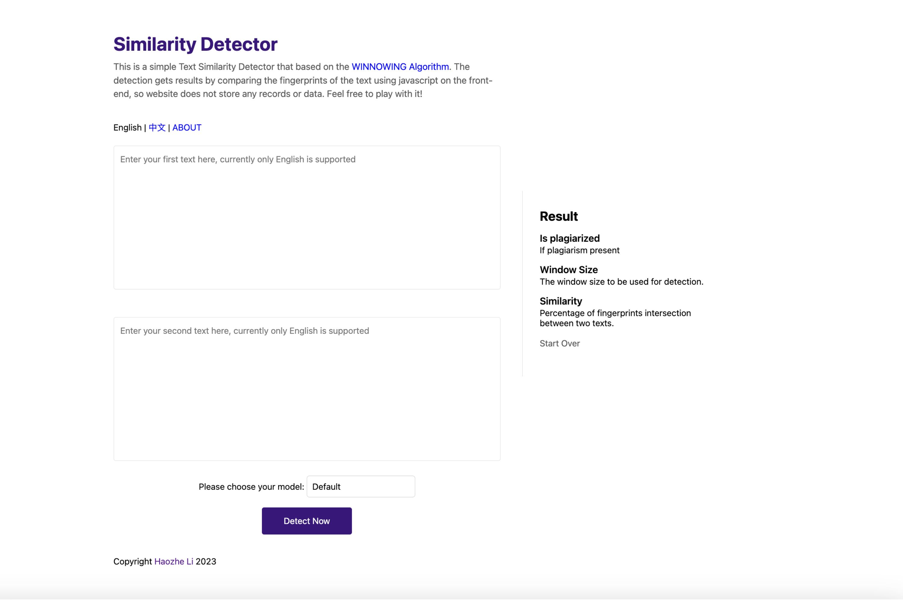

# 使用 WINNOWING 算法检测文本相似性

# 如何使用？



## 快速入门

您只需将两段文字（需英文）复制并粘贴到 [Detect.haozheli.com](http://detect.haozheli.com/)，然后点击立即检测按钮即可立即得到结果。

## 更准确地检测

以下两个小窍门可以让您的检测更准确。

- 更多字数：** 使用检测器时，确保您的文本至少有 100 个字。字数越少，检测窗口越短，可能会产生意想不到的结果。

- 更改模式：** 要更改检测模式，请使用 "立即检测 "按钮旁边的 "选择 "按钮。建议使用默认模式。但如果您得到的结果是有线的，或者想尝试新的方法，请随时将模式更改为严格或宽松模式。

- **********重新开始:********** 每次检测后，我都会建议您点击重新开始按钮。这将清除所有文本、结果、设置和缓存。这样您就可以轻松地开始检测下一项工作了。

## 了解结果

下面我将讨论结果中每个元素的含义。

- **** 是否抄袭:**** 在这里，你应该得到一个简单的 "是 "或 "否 "的答案。这是对是否抄袭的总体考虑。

- ****Window Size:****（窗口大小）这里您希望得到一个从 1 到 100 的整数。这表示为您自动生成的窗口大小。

- ******************Similarity:****************** 这里是两个文本相似的百分比。这是通过指纹交集计算得出的，因此并不意味着实际的文字交集。

# 它是如何工作的？

[Detect.haozheli.com](http://detect.haozheli.com/)通过 javascript 实现[WINNOWING 算法](https://dl.acm.org/doi/10.1145/872757.872770)，在前端获取相似度报告。因此无需上传或存储任何数据或记录。此外，由于使用了 javascript，如果您对本网站进行了缓存，则可以离线使用本工具。

## 算法概述

WINNOWING 算法是一种局部文本相似性检测技术，用于在一组文档中识别重复或接近重复的段落。它通过创建固定大小的文本 "窗口"，对这些窗口进行散列，然后在每个窗口内选择最小散列值。这些最小哈希值用于创建文档的指纹。通过比较不同文档的这些指纹，该算法可以识别出潜在的抄袭段落。

## 学术参考

我们计划实施的算法是**WINNOWING 算法**，用于文本抄袭检测。该算法在题为*"Winnowing：本文定义了该算法及其核心原理。[https://dl.acm.org/doi/10.1145/872757.872770](https://dl.acm.org/doi/10.1145/872757.872770)

为了方便我们阅读，这里是斯坦福大学网站上的 pdf 版本 [http://theory.stanford.edu/~aiken/publications/papers/sigmod03.pdf](http://theory.stanford.edu/~aiken/publications/papers/sigmod03.pdf)

它们完全相同。

## 源代码

从现在开始，我将讨论我的相似性检测器中使用的源代码。

### preprocessText 函数

- 该函数用于清理输入文本，以避免干扰信息。

- 该函数会遍历文本（字符串）中的每个字符，删除无用的符号，并将所有字母转换为小写。

- 该函数会返回一个已清理过的标记列表。

```jsx

// 预处理文本：标记化并转换为小写字母

function preprocessText(rawText) {

let tokens = []；

让 token = ""；

for (let i = 0; i < rawText.length; i++) {

让 c = rawText[i]；

if (/[a-zA-Z0-9]/.test(c) || /[\u4e00-\u9fa5]/.test(c)) {

if (/[A-Z]/.test(c)) {

token += c.toLowerCase()；

} else {

token += c.toLowerCase()

}

} else if (token !== "") {

tokens.push(token)；

token = ""；

}

}

if (token !== "") {

tokens.push(token)；

}

return tokens；

}

```

### createWindows 函数

- 该函数用于创建窗口。

- 该函数将根据 windowSize 创建一个窗口，并滑回 processedText。

- 该函数将返回所有窗口的列表。

```jsx

// 从处理过的文本中创建窗口

function createWindows(processedText, windowSize) {

让 windows = []；

for (let i = 0; i <= processedText.length - windowSize; i++) {

让 window = ""；

for (let j = i; j < i + windowSize; j++) {

window += processedText[j]；

// 如果不是窗口中的最后一个字，则只添加空格

if (j < i + windowSize - 1) {

window += " "；

}

}

windows.push(window)；

}

return windows.push(window)

}

```

### hashWindows 函数

- 该函数为每个窗口获取一个哈希值。

- 在这个函数中，我使用了一个非常简单的循环哈希值：将哈希值乘以 31，再加上字符的 ascii 值。这种哈希值计算方法非常简单，我将在以后用其他方法取代它。

- 将返回一个哈希值列表。

```jsx

// 使用简单的哈希函数对窗口进行哈希处理（应使用更好的哈希函数替换它）

function hashWindows(windows) {

让 hashes = []；

for (let i = 0; i < windows.length; i++) {

让 hash = 0；

for (let j = 0; j < windows[i].length; j++) {

让 c = windows[i].charCodeAt(j)；

hash = 31 * hash + c；

}

hashes.push(hash)；

}

return hashes；

}

```

###getFingerprints 函数

- 该函数将哈希值放入一个集合，从而剔除重复的哈希值。

- 返回一个包含称为指纹的哈希值的集合。

```jsx

// 从哈希值中获取指纹

function getFingerprints(hashes) {

let fingerprints = new Set()；

for (let i = 0; i < hashes.length; i++) {

fingerprints.add(hashes[i])；

}

return fingerprints.add(hashes[i])

}

```

### 检测敏感度和 detectPlagiarism 函数

- 代码的前七行用于获取用户选择的敏感度以及相似性声明。

- detectPlagiarism 函数会计算两个文本指纹的交集，并计算交集的重叠百分比。如果该百分比大于用户设置的灵敏度阈值，就会返回 True，表明存在剽窃行为。

- detectPlagiarism 返回一个布尔值（真或假）。

```jsx

让 percentage = 0；

const sensitivitySelect = document.getElementById('sensitivity')；

let sensitivity = 4；

sensitivitySelect.addEventListener('change', function () {

const selectedValue = sensitivitySelect.value；

sensitivity = parseInt(selectedValue)；

});

// 通过比较指纹检测剽窃行为

function detectPlagiarism(fingerprints1, fingerprints2) {

let intersection = new Set([...fingerprints1].filter(x => fingerprints2.has(x)))；

让 intersectionSize = intersection.size；

let union = new Set([...fingerprints1, ... fingerprints2])；

let unionSize = union.size；

让相似度 = intersectionSize / unionSize；

percentage = similarity * 100；

返回 percentage > sensitivity；

}

```

### runPlagiarismDetection 函数

- 此函数将运行上述所有函数并显示结果。

```jsx

函数 runPlagiarismDetection() {

// 从文本框中获取输入文本

let text1 = document.getElementById("text1").value；

let text2 = document.getElementById("text2").value；

// 对文本进行预处理

let processedText1 = preprocessText(text1)；

let processedText2 = preprocessText(text2)；

let windowSize = text1.length < text2.length ?Math.floor(text1.length / 10) ：让 windowSize = text1.length < text2.length ?

如果 (windowSize < 1) {

windowSize = 1；

}

如果 (windowSize > 100) {

windowSize = 100；

}

document.getElementById("windowize").innerText = windowSize；

// 创建窗口

让 windows1 = createWindows（processedText1，windowSize）；

让 windows2 = createWindows（processedText2，windowSize）；

// 对窗口进行散列

let hashes1 = hashWindows(windows1)；

让 hashes2 = hashWindows(windows2)；

// 获取指纹

let fingerprints1 = getFingerprints(hashes1)；

let fingerprints2 = getFingerprints(hashes2)；

// 检测剽窃行为

let isPlagiarized = detectPlagiarism(fingerprints1, fingerprints2)；

document.getElementById("fg").innerText = Math.floor(percentage) + "%"；

// 显示结果

document.getElementById("result").innerText = isPlagiarized ?"True" : "False"；

}

```

# 结束

恭喜你看到这里！本文到此结束，希望你已经会使用相似性检测器，并了解了它的工作原理。如果你有任何疑问，欢迎在文章中发表评论，或登录我的网站 [haozheli.com](https://www.haozheli.com/) 联系作者。

本文作者 @浩哲李。